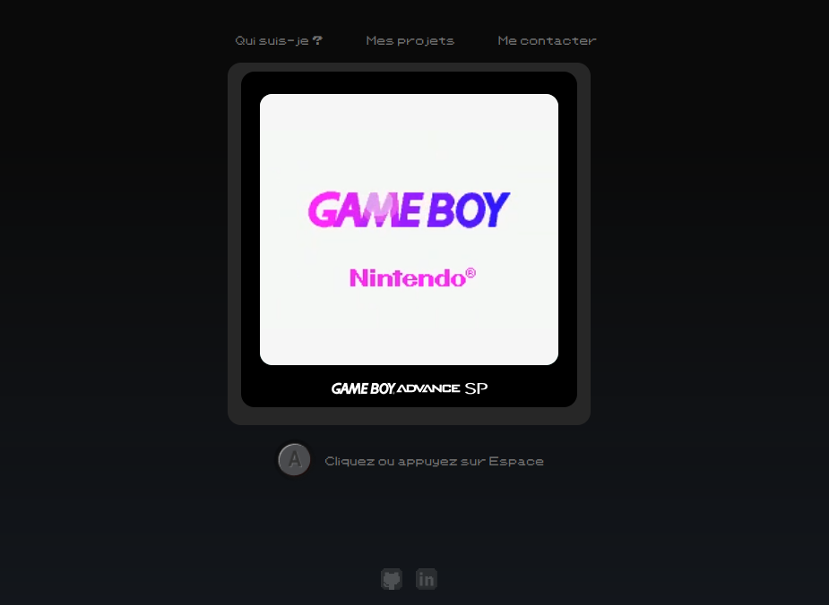

# Portfolio Daniel Tangoletto

## Portfolio version Gameboy crée en ReactJS

Vous trouverez ici la version précédente de mon **[Portfolio](https://danieltangoletto.github.io/dt_portfolio/)** qui fut le portfolio présenté pour ma dernière soutenance de la formation Développeur Web chez OpenClassrooms.

Depuis j'ai voulu crée un site un peu plus propre et un peu plus élaboré que ce dernier.
Pour affiner mes connaissances et pratiquer, j'ai souhaité concevoir ce site en React.

**[Nouveau portfolio](https://danieltangoletto.github.io/portfolio_gb/)**